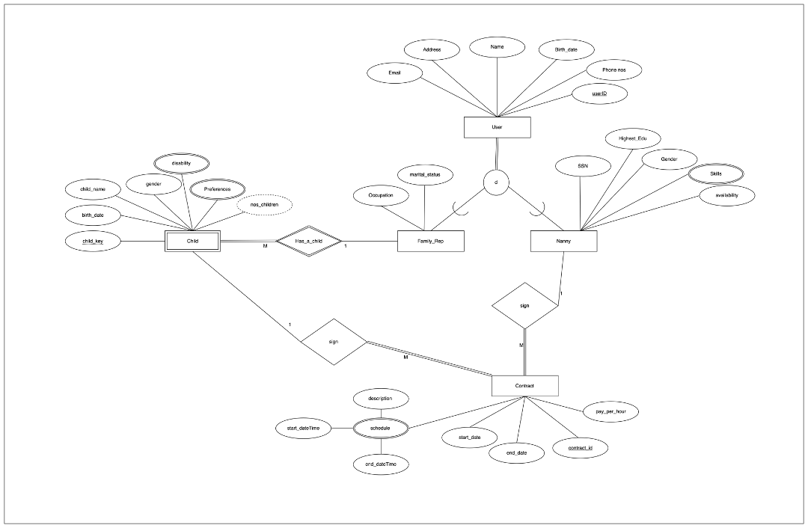
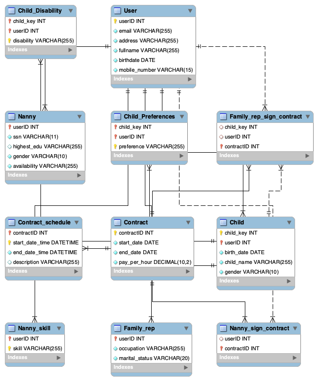

<h1> Sitters Database Project Documentation</h1>

## 1. Company Overview
**Name:** Sitters  
**Tagline:** Bringing families closer to nannies.

## 2. Project Title
Database for Sitters: A Babysitting Service Provider

## 3. Project Description
The Sitters database is designed to efficiently store and manage data concerning users (nannies and families), and details about the babysitting contracts. It captures comprehensive information about nannies including personal details, qualifications, skills, and availability. For families, it records details such as contact information, marital status, and specifics about children including their preferences and any disabilities. Contracts between families and nannies detailing terms, payments, and schedules are also stored, along with reviews and comments post-contract.

## 4. Assumptions about Cardinality and Participation
- A family can book multiple nannies.
- A nanny can be booked by multiple families.
- Contracts require total participation from both nannies and families.
- Each family must have at least one child, with each child belonging to only one family.
- Families can have multiple children requiring nanny services, potentially with different nannies.

## 5. EER Modeling Diagram

## 6. ER-Model Mapping to Database Relational Schema
The database schema is designed to reflect the relationships and attributes discussed, with tables for users, family representatives, nannies, contracts, children, and their preferences and disabilities. 

**User**(userID, email, address, fullname, birthdate, mobile_number)  
**Family_rep**(userID, occupation, marital_status)  
**Nanny**(userID, ssn, highest_edu, gender, availability)  
**Nanny_skill**(userID, skill)  
**Contract**(contractID, start_date, end_date, pay_per_hour)  
**Contract_schedule**(contractID, start_date_time, end_date_time, description)  
**Child**(child_key, userID, birth_date, child_name, gender)  
**Child_Preferences**(child_key, userID, preference)  
**Child_Disability**(child_key, userID, disability)  
**Family_rep_sign_contract**(child_key, userID, contractID)  
**Nanny_sign_contract**(userID, contractID)  

## 7. EER Modeling Diagram Reversed engineered in MYSQL Workbench

## 8. Normalization
All relations are normalized up to BCNF, eliminating partial and transitive dependencies. This ensures efficient data storage and retrieval, minimizing redundancy and potential anomalies.

## 9. Determining Data Types and Constraints
Data types and constraints are chosen to best represent the nature of the data and ensure its integrity. For example:
- IDs are integers for efficient processing.
- Dates and times are stored in appropriate formats to capture necessary temporal details.
- Fixed and variable-length strings are used to store textual data, with specific lengths for attributes like SSN to enforce consistency.
- Decimal types are used for financial figures to accurately represent monetary values.

## 10. SQL Queries
1. List all users with their name, email addresses, age and addresses that are more than 30 years old.
2. List all users with their userID, name and userType.
3. Find the name and age of the oldest child.
4. Show the details of users who have a family representative role.
5. List all contracts along with their start dates and end dates.
6. Retrieve the names of users who have signed contracts as family representatives.
7. Find the distinct skills that nannies possess.
8. Show the details of users who have preferences for children.
9. Find the count of nannies for each gender.
10. List the names and preferences (With or without) of children with their family rep name who have disabilities or no disabilities. 
11. Find the number of children for each family representative.
12. List all users who are parents (have children).
13. Find all nannies who have specific skills.( 'Child Care', 'First Aid')
14. Find all contracts where a child has preferences.
15. Find the average age of parents.
16. Find the most common preference among children.
17. Find the total pay for each schedule.
18. Find the total pay for each contract.
19. The highest paid Nanny per hour.
20. Find all single parent with full details.